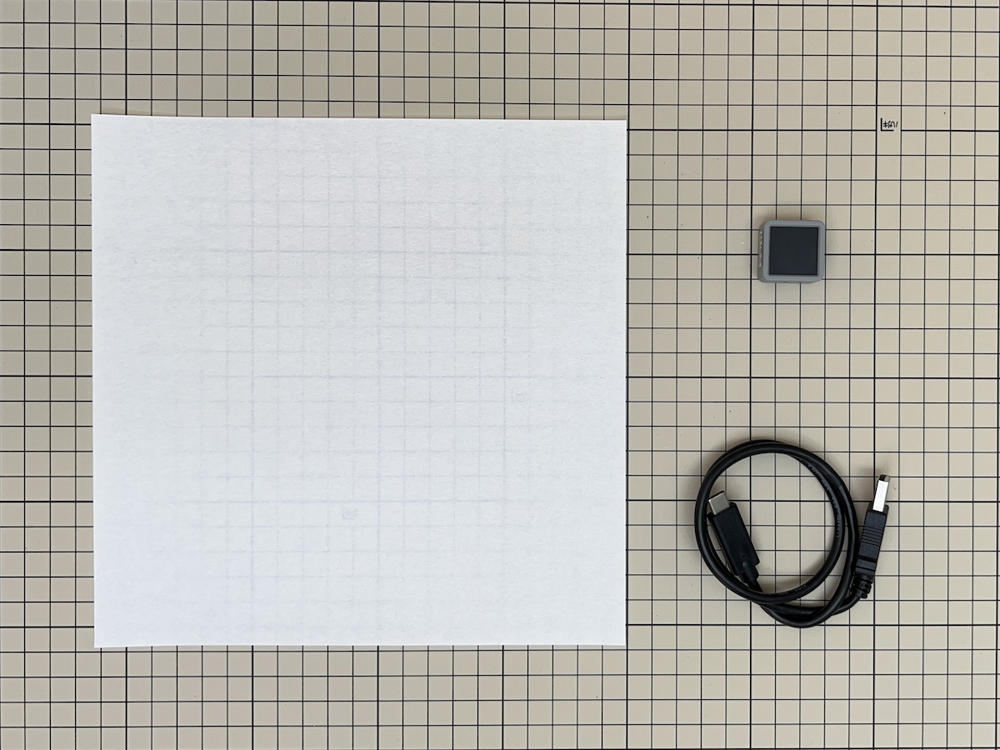
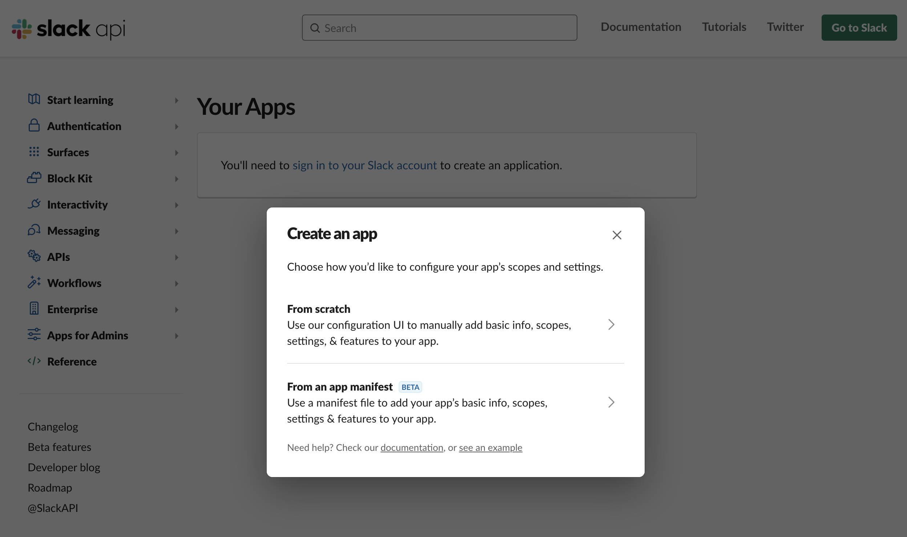
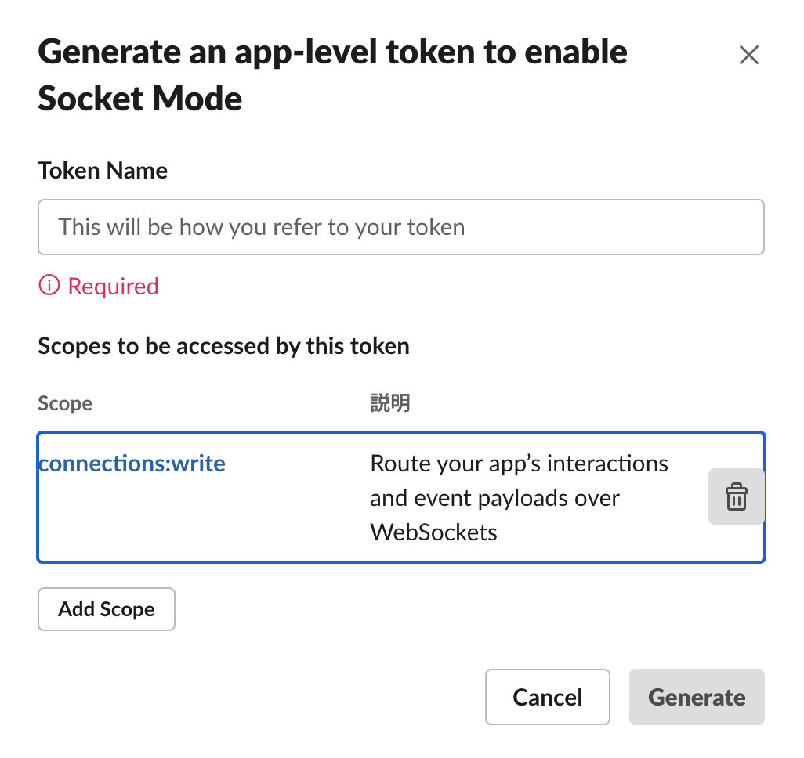
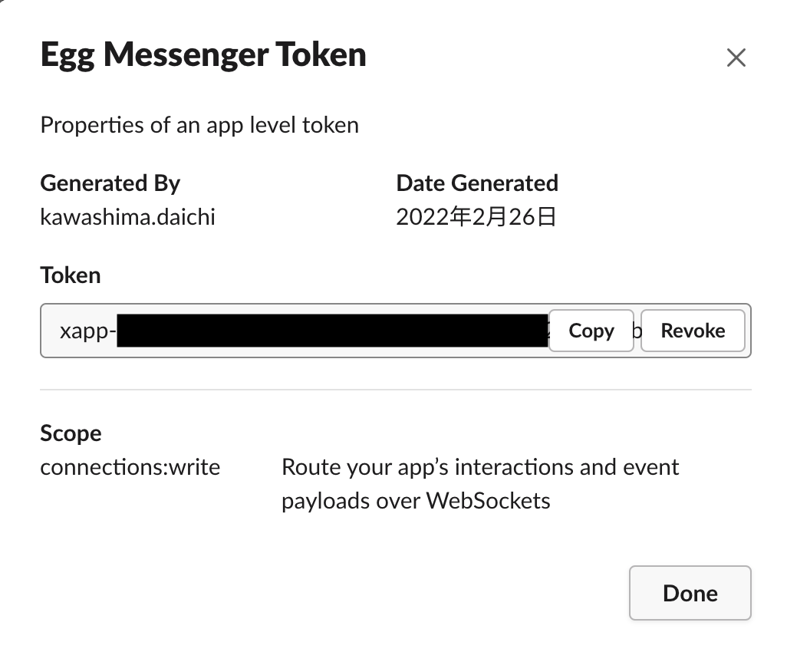
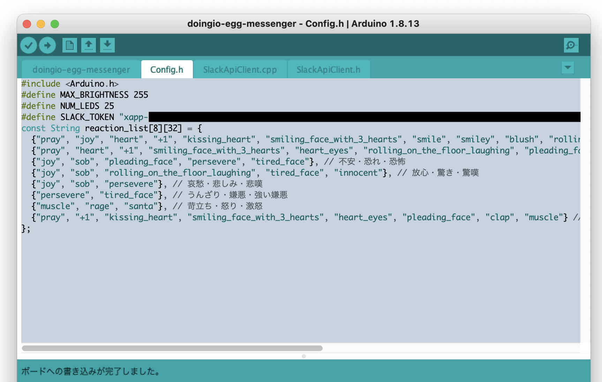
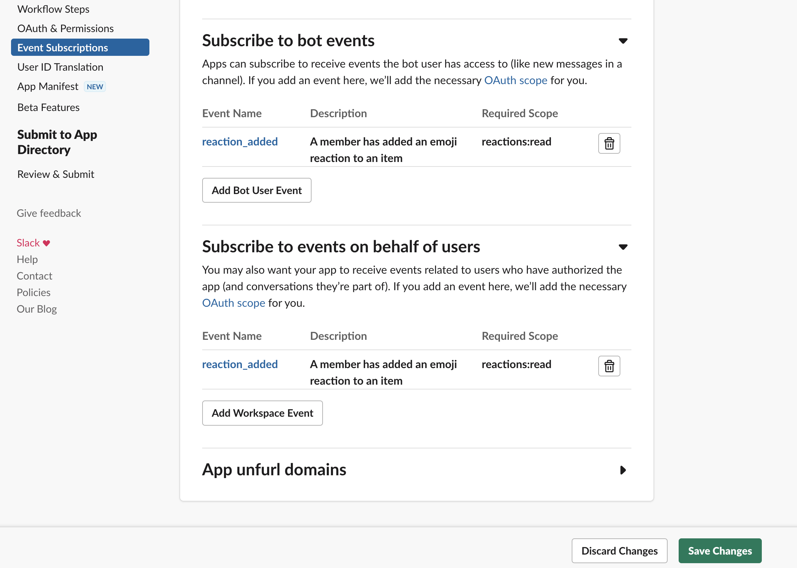
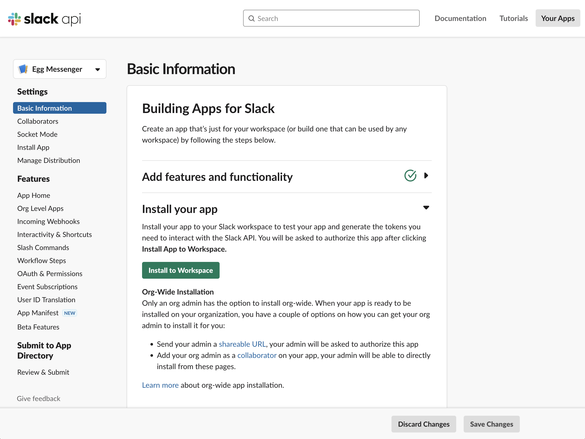
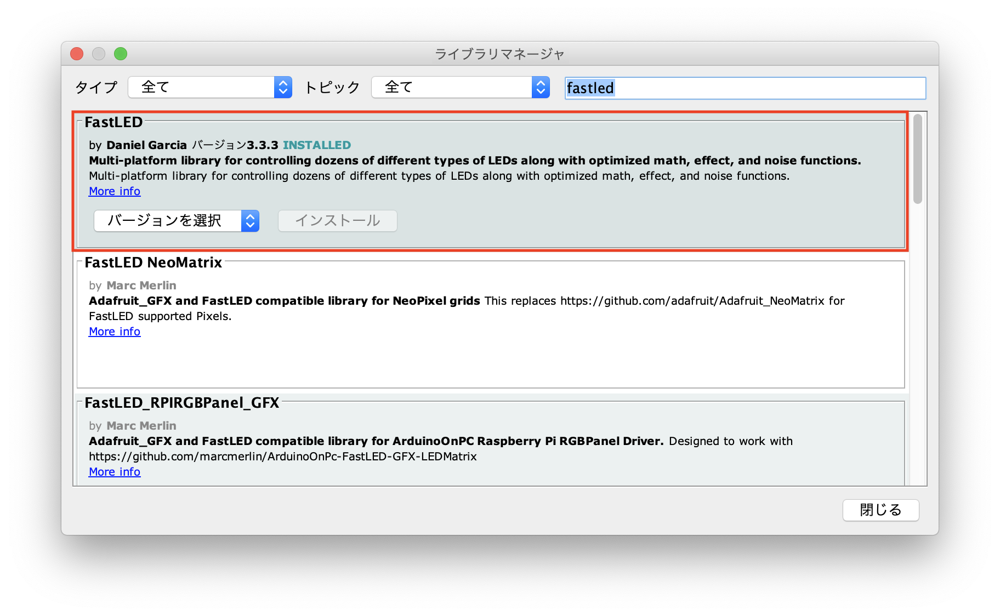
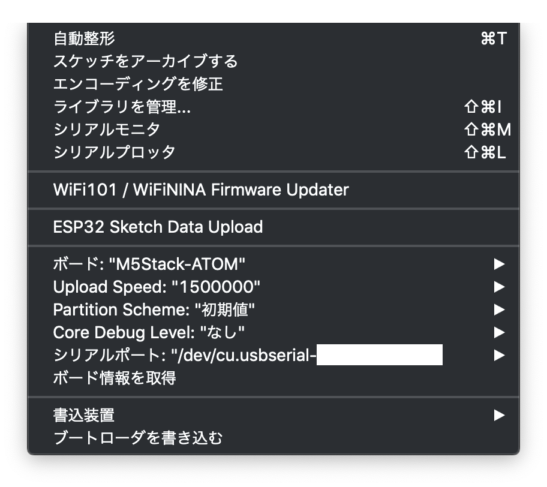
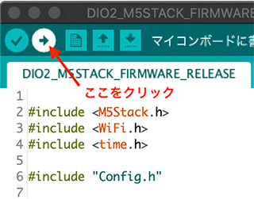

## 【D+IO Product #9】Egg Messengerのレシピ 
### 〜 メッセージアプリ上のリアクションを光の色でフィードバックする照明デバイス 〜
### [わたしたちのウェルビーイングのためのハッカソン2021](https://newstories.jp/wbh/) D+IO賞 受賞プロダクト ###

### プロダクト概要

リモート環境で働いている際、メッセージアプリ上で「いいね！」などのリアクションを受け取っても、リアルな場で激励されたときほどの感動は起きないものです。

この「Egg Messenger」は、Slackのリアクションを受け取り、光の色で表現する照明デバイス。

離れた場所で働く仕事仲間からのフィードバックを光で体感し、個人の幸福感ややる気を向上させたい、という想いから生まれました。

引用 : https://youth-note.jpn.panasonic.com/n/nc1dbcb0370f3

 

##  D+IO Project

**パナソニック株式会社/FUTURE LIFE FACTORY**

[D+IO プロジェクト詳細](https://panasonic.co.jp/design/flf/works/doing_io/)

 

## 作り方
  
### 1 準備

- 必要なパーツを用意

|     | 部品名     | 個数 |  販売リンク（例）  | 備考 |
|:----:|:---------|:----|:------------------------|:----|
|  1 (必須) | ATOM Matrix | 1 |[スイッチサイエンス](https://www.switch-science.com/catalog/6260/) | |
|  2 (必須) | USB Type-Cケーブル | 1 | [スイッチサイエンス](https://www.switch-science.com/catalog/3792/) | 給電用 （必要に応じて適切な長さのUSBケーブルを購入してください） |
|  3  | 折り紙など(ハウジング用)| 1 | | 身の回りにある素材などでご自身で自由に製作してみましょう |

★ 参考価格（総額） : 約2,431円

### 2 開発環境のダウンロードとインストール

下記リンクを参考に開発環境をインストールしてください。

(今回使用するデバイスは【ATOM Matrix】です。FastLEDライブラリのインストールも必要です。)

[M5Stack開発環境のダウンロードとインストール](https://github.com/panasonic-corporation/doingio-base-docs/blob/master/README.md#a-m5stack%E9%96%8B%E7%99%BA%E7%92%B0%E5%A2%83%E3%81%AE%E3%83%80%E3%82%A6%E3%83%B3%E3%83%AD%E3%83%BC%E3%83%89%E3%81%A8%E3%82%A4%E3%83%B3%E3%82%B9%E3%83%88%E3%83%BC%E3%83%AB)

### 3 ファームウェアのダウンロード

1. ファームウェアをダウンロードしてください。

    こちらのリンクからzipファイルをダウンロード
    
    https://github.com/panasonic-corporation/doingio-egg-messenger/archive/refs/heads/main.zip

1. プロジェクトを開いてください。

    ダウンロードしたフォルダを開き、doingio-egg-messenger/doingio-egg-messenger.ino をダブルクリックしてArduino IDEで開きます。

### 4 Slackトークンの取得

1. [slack api](https://api.slack.com/apps?new_app=1)にアクセスし、「From scratch」を選択

    

1. 「App Name」に好きなアプリ名を入力し、「Pick a workspace to develop your app in:」にEgg Messengerで使用するSlackのWorkspaceを選択してください。
（サインインしていない場合は「Sign into a different workspace」からサインインしてください）

    

1.  左側のメニューからSettings→Socket Modeを選択し、Enable Socket ModeをONに変更

1.  「Token Name」に任意のトークン名を入力し「Generate」をクリック

    

1.  「xapp-」から始まるTokenをコピーし、Doneをクリック

    

1. Arduino IDEに戻り、Config.hの#define SLACK_TOKENに先程のトークンを入力   

    

1. 左側のメニューからFeatures→Event Subscriptionsを選択し、Enable EventsをONに変更

1. Subscribe to bot eventsの「Add Bot User Event」を選択し、「reaction_added」を追加。同様にSubscribe to events on behalf of usersの「Add Workspace Event」を選択し、「reaction_added」を追加。最後に右下の「Save Changes」を選択して設定を保存

    

1. 最後に、Basic Informationから「Install to Workspace」を選択してEgg Messengerの機能をSlackのWorkspaceに追加します

    

## 5 ライブラリのダウンロードとインストール

1. ”スケッチ” → ”ライブラリをインクルード” → ”ライブラリを管理”「fastled」と検索して「FastLED」をインストールしてください  

    

### 6 書き込み

1. PCとデバイスをUSBケーブルで接続し、Arduino IDEの「ツール」タブを開き下記の通り設定します。

    

1. 「書き込み」アイコンをクリックしてArduinoにファームウェアを書き込みます。

    

### 7 ハウジングの作成 (任意)

ケースは皆さんのアイディアで自由に作ってみましょう！

作ったケースはハッシュタグ #dio_product でTwitterやInstagramなどでどんどんシェアしてください！

下記リンクを参考に和紙の折り紙などでハウジングを作ってみましょう。

[ハウジングの作り方](https://www.youtube.com/watch?v=vBYcyp9RenI)

### 8 カスタマイズ (任意)

* リアクションと光る色の対応はデフォルトでは下記の表のとおりです。

    感情と色の対応は、[プルチックの感情の輪](https://ja.wikipedia.org/wiki/%E6%84%9F%E6%83%85%E3%81%AE%E4%B8%80%E8%A6%A7) で定義されている感情と色の分布から、Slackのリアクションに対応すると思われる感情・色を紐付けています。

    | |平穏・喜び・恍惚|容認・信頼・敬愛|不安・恐れ・恐怖|放心・驚き・驚嘆|哀愁・悲しみ・悲嘆|うんざり・嫌悪・強い嫌悪|苛立ち・怒り・激怒|関心・期待・警戒|
    |:----|:----|:----|:----|:----|:----|:----|:----|:----|
    | 色 |黄|黄緑|緑|水色|青|ピンク|赤|橙|
    |🙏 pray|TRUE|TRUE|FALSE|FALSE|FALSE|FALSE|FALSE|TRUE|
    |😂 joy|TRUE|FALSE|TRUE|TRUE|TRUE|FALSE|FALSE|FALSE|
    |❤️ heart|TRUE|TRUE|FALSE|FALSE|FALSE|FALSE|FALSE|FALSE|
    |👍 +1|TRUE|TRUE|FALSE|FALSE|FALSE|FALSE|FALSE|TRUE|
    |😭 sob|FALSE|FALSE|TRUE|TRUE|TRUE|FALSE|FALSE|FALSE|
    |😘 kissing_heart|TRUE|FALSE|FALSE|FALSE|FALSE|FALSE|FALSE|TRUE|
    |🥰 smiling_face_with_3_hearts|TRUE|TRUE|FALSE|FALSE|FALSE|FALSE|FALSE|TRUE|
    |😍 heart_eyes|FALSE|TRUE|FALSE|FALSE|FALSE|FALSE|FALSE|TRUE|
    |😊 smile smiley blush|TRUE|FALSE|FALSE|FALSE|FALSE|FALSE|FALSE|FALSE|
    |🤣 rolling_on_the_floor_laughing|TRUE|TRUE|FALSE|TRUE|FALSE|FALSE|FALSE|FALSE|
    |🥺 pleading_face|TRUE|TRUE|TRUE|FALSE|FALSE|FALSE|FALSE|TRUE|
    |🙌 raised_hands|TRUE|FALSE|FALSE|FALSE|FALSE|FALSE|FALSE|FALSE|
    |👏 clap|TRUE|TRUE|FALSE|FALSE|FALSE|FALSE|FALSE|TRUE|
    |💪 muscle|FALSE|FALSE|FALSE|FALSE|FALSE|FALSE|TRUE|TRUE|
    |😣 persevere|FALSE|FALSE|TRUE|FALSE|TRUE|TRUE|FALSE|FALSE|
    |😫 tired_face|FALSE|FALSE|TRUE|TRUE|FALSE|TRUE|FALSE|FALSE|
    |😇 innocent|TRUE|FALSE|FALSE|TRUE|FALSE|FALSE|FALSE|FALSE|
    |😡 rage|FALSE|FALSE|FALSE|FALSE|FALSE|FALSE|TRUE|FALSE|
    |🎅 santa|FALSE|FALSE|FALSE|FALSE|FALSE|FALSE|TRUE|FALSE|

    上記の表に載っていないリアクションが送られた場合は白く光るようになっていますが、白以外の色に反応するするリアクションを増やしたい場合や、リアクションの色を変更したい場合は**Config.h の reaction_list 配列**をカスタマイズしてください。

   

## ライブラリ及びライセンス
| ライブラリ名| 配布元 | コピーライトまたは貢献者 | ライセンス |
|:---|:----|:----|:----|
|M5Atom|[URL](https://github.com/m5stack/M5Atom)|Copyright (c) 2021 by M5Stack|[LICENSE](https://github.com/m5stack/M5Atom/blob/master/LICENSE)|
| FastLED | [URL](https://github.com/FastLED/FastLED) | Copyright (c) 2013 FastLED | [LICENSE](https://github.com/FastLED/FastLED/blob/master/LICENSE) |
